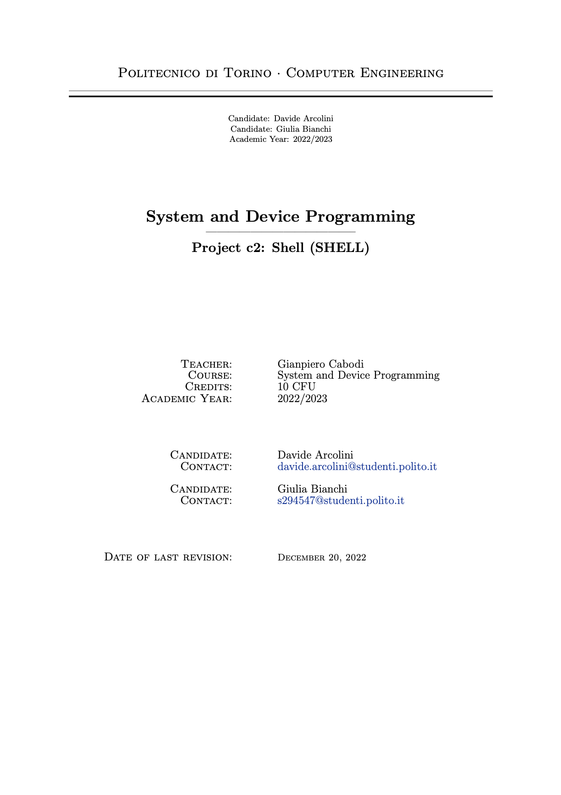

# OS161 - SHELL
- **Project**: c2 (shell)
- **Year**: A.Y. 2021/2022
- **Course**: System and Device Programming
- **Teacher**: **Gianpiero Cabodi**
- **Authors**:
    - Davide Arcolini (s295229)
    - Giulia Bianchi (s294547)

---
### Project's Summary
The purpose of this project is to support running multiple processes at once from actual compiled programs stored on disk. These programs will be loaded into OS161 and executed in user mode, under the control of your kernel and the command shell in bin/sh (menu command: p bin/sh). The project is highly based on the availability of the execv and dup2 system calls. The project can be limited to the EMUFS emulated file system